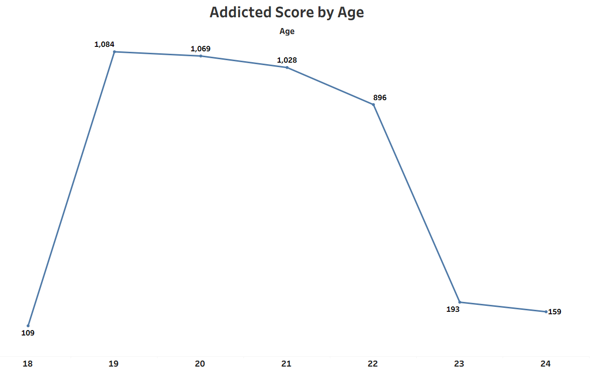
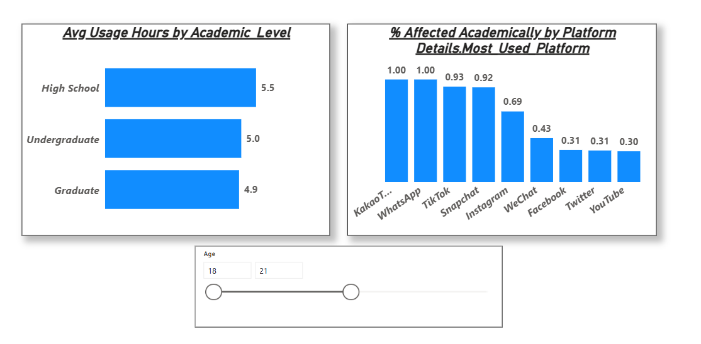
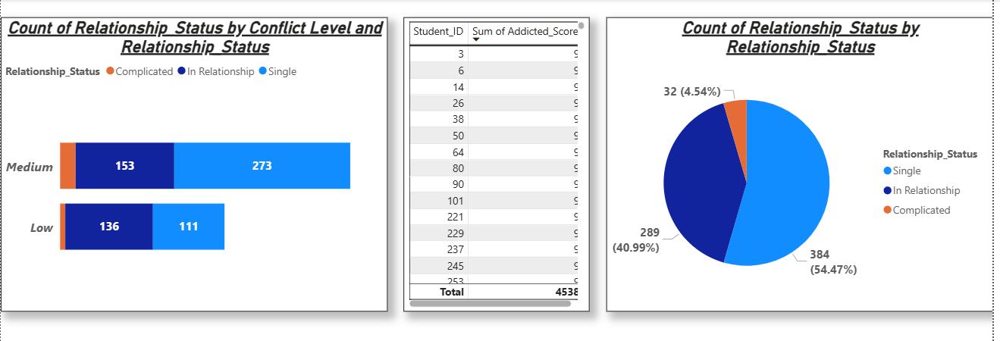

# 📱 Student Social Media Addiction: A Dual-Tool Analysis Case Study

> **Dataset:** 705 students across multiple countries | **Tools:** Power BI & Tableau | **Domain:** Student Digital Wellness

---

## 🎯 Project Overview

This project investigates the impact of social media usage on **705 students globally**, analyzing relationships between addiction scores, academic performance, mental health, sleep patterns, and relationship conflicts. By building this analysis in both **Power BI** and **Tableau**, the project demonstrates technical versatility and the ability to maintain data consistency across different BI environments.

---

## 🛠️ Software Proficiency & Technical Stack

- **Power BI:** Focused on **Star Schema Modeling**, advanced **DAX measures**, and **Bookmark/Selection Pane** interactivity for storytelling.
- **Tableau:** Focused on **LOD (Level of Detail) Expressions**, **Dashboard Composition**, and **Interactive Actions**.
- 🔗 **[View Interactive Tableau Dashboard](https://public.tableau.com/app/profile/gopal.sarkar/viz/SocialMediaAddictionDashboard_17734785612930/Dashboard1)**

> **📌 Note on Data:** The core dataset (`Students_Social_Media_Addiction.xlsx`) contains 10 fields: Student ID, Age, Gender, Academic Level, Country, Sleep Hours Per Night, Mental Health Score, Relationship Status, Conflicts Over Social Media, and Addicted Score. The **"Most Used Platform"** and **"Avg Usage Hours"** visuals in Power BI were built from an enriched version of the dataset that includes additional platform-level fields.

---

## 📊 Dual-Platform Comparative Analysis

### 1. Executive Performance Overview
Primary dashboard view tracking total students, average usage, addiction distribution, and key KPIs.

| Power BI Dashboard (Page 1) | Tableau Dashboard (Dashboard 1) |
| :---: | :---: |
|  |  |

**💡 Strategic Insight:** Both platforms confirm a dataset of **705 students** with an average addiction score of **6.44/10** and average sleep of **6.87 hrs/night** — indicating widespread moderate-to-high addiction levels across the sample.

---

### 2. Mental Health & Behavioral Trends
Analyzing the relationship between addiction scores and psychological wellness across the student population.

| Power BI Analysis (Page 2) | Tableau Analysis (Line Chart) |
| :---: | :---: |
|  |  |

**💡 Strategic Insight:** A strong **-0.95 negative correlation** exists between addiction score and mental health score. As addiction levels rise, mental health scores decline significantly — highlighting an urgent need for institutional digital wellness interventions.

---

### 3. Academic Impact & Sleep Analysis
A deep dive into how addiction levels and sleep deprivation vary across education tiers (High School, Undergraduate, Graduate).

| Power BI Analysis (Page 3) | Tableau Analysis (Column Chart) |
| :---: | :---: |
|  |  |

**💡 Strategic Insight:** High School students were found to be the most vulnerable group, averaging only **5.46 hrs of sleep per night** — the lowest of all academic levels — driven by high late-night social media engagement.

---

### 4. Global Hotspots & Relationship Conflicts (Top 10 Countries)
Ranking countries with the highest addiction scores and examining how relationship status correlates with social media conflict.

| Power BI Analysis (Page 4) | Tableau Analysis (Bar Chart) |
| :---: | :---: |
|  |  |

**💡 Strategic Insight:** **India** and the **USA** lead globally in cumulative addiction scores (398 and 344 respectively). Students with a "Complicated" relationship status reported the highest average conflict scores over social media, slightly above those in relationships or single — suggesting digital habits intersect with personal relationship stress.

---

## 📈 Key Data Findings

| Metric | Value |
|---|---|
| Total Students | 705 |
| Avg Addicted Score | 6.44 / 10 |
| Avg Sleep Hours (Overall) | 6.87 hrs/night |
| Avg Sleep — High School | 5.46 hrs/night ⚠️ |
| Avg Sleep — Undergraduate | 6.83 hrs/night |
| Avg Sleep — Graduate | 7.03 hrs/night |
| Mental Health Correlation | **-0.95** (strong negative) |
| Most Single Students | 384 (54.47%) |
| Gender Split | Female 353 (50.07%) / Male 352 (49.93%) |
| Top Country (Addiction Score) | India (398) |

---

## 💡 Final Strategic Recommendations

1. **Age-Targeted Outreach:** Prioritize wellness workshops for the **19–22 age segment**, where cumulative addiction scores peak (1,028–1,084 range) before declining sharply.
2. **High School First:** Despite being the smallest group (27 students), High School students show the most alarming sleep deprivation at 5.46 hrs/night. Early intervention programs are critical.
3. **Mental Health Integration:** Given the near-perfect -0.95 correlation, institutions should treat social media addiction screening as part of routine mental health assessments.
4. **Data-Driven Counseling:** Provide wellness teams with these dashboards to identify high-risk individuals — particularly those in the "Complicated" relationship category — before performance and wellbeing deteriorate.

---

## 📂 Project Structure

```
📁 Social-Media-Addiction-Analysis/
│
├── 📁 Power_BI_Project/
│   └── Social_Media_Addiction_Analysis_Dashboard_PowerBI_.pbix
│
├── 📁 Tableau_Project/
│   └── Social_Media_Addiction_Tableau_Viz.twb
│
├── 📁 Data/
│   └── Students_Social_Media_Addiction.xlsx
│
└── 📁 Pictures/
    ├── PBI_Overview.png
    ├── PBI_MentalHealth.png
    ├── PBI_Academics.png
    ├── PBI_Conflicts.png
    ├── Tab_Overview.png
    ├── Tab_MentalHealth.png
    ├── Tab_Academics.png
    └── Tab_Top10.png
```

> **⚠️ Tableau Note:** The `.twb` file references an external data source. To open it correctly, ensure `Students_Social_Media_Addiction.xlsx` is in the same directory, or re-point the data connection after opening. Alternatively, use the [live Tableau Public link](https://public.tableau.com/app/profile/gopal.sarkar/viz/SocialMediaAddictionDashboard_17734785612930/Dashboard1) for a no-setup interactive experience.

---

*Analysis conducted using Power BI Desktop and Tableau Public. Dataset contains 705 student records across 10 behavioral and demographic variables.*
