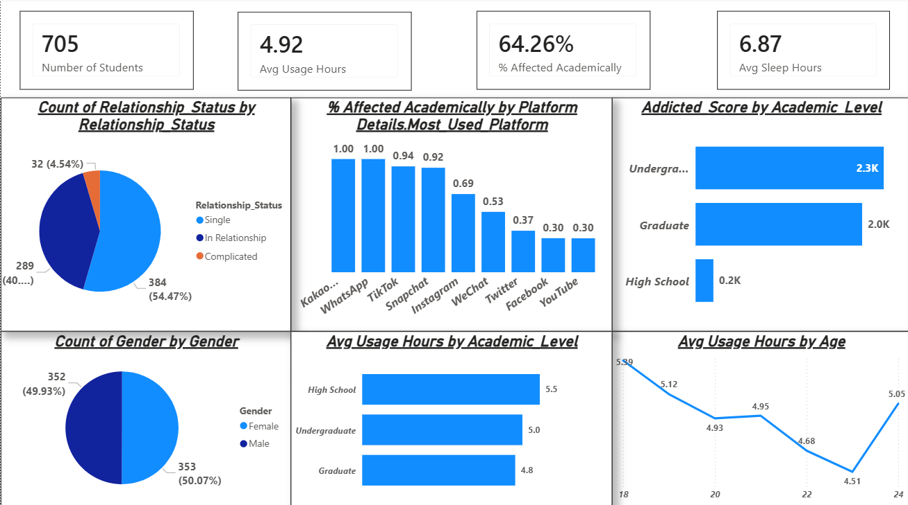
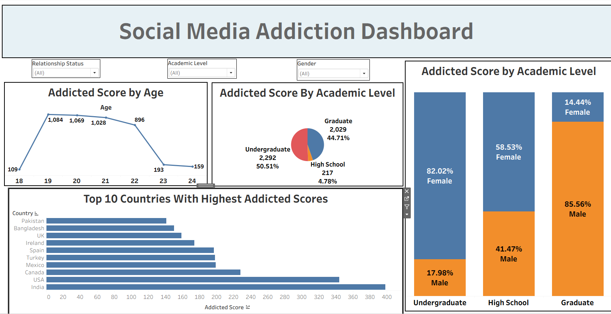
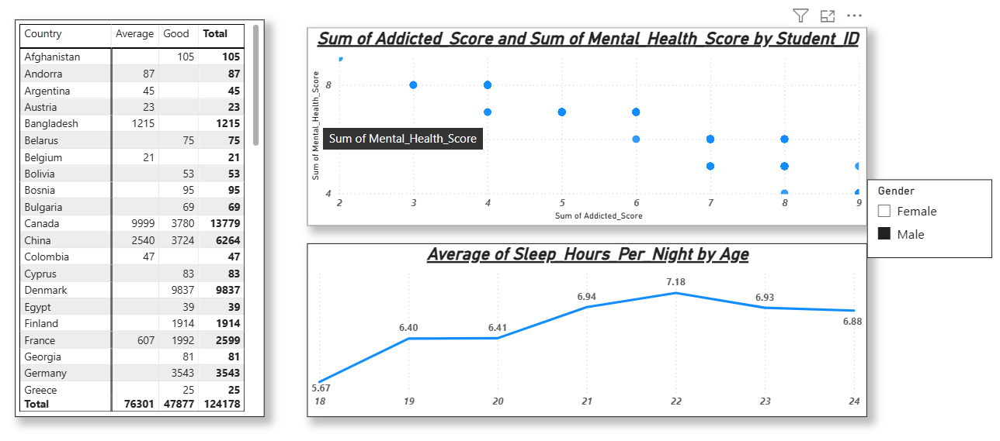
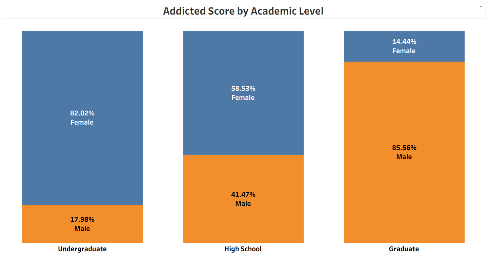
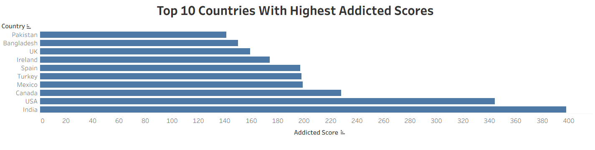

# Social-Media-Addiction-Analysis

# 📱 Student Social Media Addiction: A Dual-Tool Analysis Case Study

### 🎯 Project Overview
This project investigates the impact of social media usage on **705 students globally**. By building this analysis in both **Power BI** and **Tableau**, I demonstrate technical versatility and the ability to maintain data consistency across different BI environments.

---

## 🛠️ Software Proficiency & Technical Stack
- **Power BI:** Focused on **Star Schema Modeling**, advanced **DAX measures**, and **Bookmark/Selection Pane** interactivity for storytelling.
- **Tableau:** Focused on **LOD (Level of Detail) Expressions**, **Dashboard Composition**, and **Interactive Actions**.
- 🔗 **[View Interactive Tableau Dashboard](https://public.tableau.com/app/profile/gopal.sarkar/viz/SocialMediaAddictionDashboard_17734785612930/Dashboard1)**

---

## 📊 Dual-Platform Comparative Analysis

### 1. Executive Performance Overview
Primary dashboard view tracking total students, average usage, and overall addiction distribution.

| Power BI Dashboard | Tableau Dashboard |
| :---: | :---: |
|  |  |

**💡 Strategic Insight:** Both platforms confirm **705 students** with an average addiction score of **6.44/10** and average sleep of **6.87 hrs/night**, indicating widespread moderate-to-high addiction levels across the sample.

---

### 2. Mental Health & Behavioral Trends
Analyzing the relationship between addiction scores and psychological wellness scores across the student population.

| Power BI Analysis |
| :---: |
|  |

**💡 Strategic Insight:** A strong **-0.95 negative correlation** exists between addiction score and mental health score. As addiction levels rise, mental health scores decline sharply — highlighting an urgent need for institutional digital wellness interventions.

---

### 3. Academic Impact by Gender
How addiction scores are distributed across academic levels, broken down by gender.

| Tableau Analysis |
| :---: |
|  |

**💡 Strategic Insight:** High School students are the most vulnerable group, averaging only **5.46 hrs of sleep per night** — the lowest of all academic levels. Undergraduate females account for **82%** of that group's addiction score share.

---

### 4. Global Hotspots — Top 10 Countries
Ranking countries with the highest addiction scores to identify where digital wellness resources are most needed.

| Tableau Analysis |
| :---: |
|  |

**💡 Strategic Insight:** **India** and the **USA** lead globally with cumulative addiction scores of **398** and **344** respectively — together accounting for a significant share of the total sample's addiction burden.

---

## 📈 Key Data Findings at a Glance

| Metric | Value |
|---|---|
| Total Students | 705 |
| Avg Addiction Score | 6.44 / 10 |
| Avg Sleep Hours (Overall) | 6.87 hrs/night |
| Avg Sleep — High School | **5.46 hrs/night** ⚠️ |
| Avg Sleep — Undergraduate | 6.83 hrs/night |
| Avg Sleep — Graduate | 7.03 hrs/night |
| Mental Health Correlation | **-0.95** (strong negative) |
| Gender Split | Female 353 (50.07%) / Male 352 (49.93%) |
| Relationship Status | Single 54.47% / In Relationship 40.99% / Complicated 4.54% |
| #1 Country (Addiction Score) | 🇮🇳 India (398) |

---

## 💡 Final Strategic Recommendations
1. **Age-Targeted Outreach:** Prioritize wellness workshops for the **19–22 age segment**, where addiction scores peak (1,028–1,084 range) before declining sharply.
2. **High School First:** Despite being the smallest group, High School students show the most alarming sleep deprivation at **5.46 hrs/night**. Early intervention is critical.
3. **Mental Health Integration:** Given the near-perfect **-0.95 correlation**, institutions should treat social media addiction screening as part of routine mental health assessments.
4. **Data-Driven Counseling:** Provide wellness teams with these dashboards to identify high-risk individuals before performance and wellbeing deteriorate.

---

## 📂 Project Structure

```
📁 Social-Media-Addiction-Analysis/
│
├── 📁 Data/
│   └── Raw_Student_Behavior_Dataset.xlsx
│
├── 📁 Pictures/
│   ├── PBI_Overview.png
│   ├── PBI_MentalHealth.png
│   ├── Tab_Academics.png
│   └── Tab_Top10.png
│   └── Tab_Overview.png
│
├── 📁 Power_BI_Project/
│   └── Social_Media_Addiction_Analysis_Dashboard_PowerBI_.pbix
│
└── 📁 Tableau_Project/
    └── Social_Media_Addiction_Tableau_Viz.twb
```
